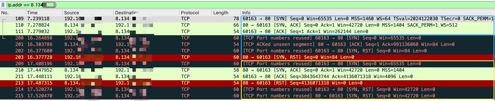

# go-switch-hosts

`go-switch-hosts` 是一个无 GUI 图形的、管理 hosts 文件的 Go 程序。

## 注意

本程序还在持续开发中，请谨慎使用。操作之前建议先保存本地的 hosts 文件，再进行测试。

## 特性

- 原生二进制文件，极低的资源占用；
- 原生跨平台：支持 macOS / Linux / Windows(待实现) 系统；
- TOML 配置：您可以将配置文件放在 IDE / 代码编辑器中，变更后自动切换 hosts；
- **自动关闭 TCP 连接：切换 hosts 后自动关闭残留的 TCP 连接，无需打开浏览器手工断开 socket 连接才生效！！！**
    - 可以点开 GitHub 这个 Issue 看看 -> [oldj /
      SwitchHosts #160](https://github.com/oldj/SwitchHosts/issues/160)

## 安装

依赖 libpcap 和 Go 编译器，使用 Go 1.19 测试通过。请提前安装依赖。不要关闭 CGO 哈～

为解析连接的 IP 使用的网卡信息，需要以下命令：

- netstat
- route
- ip
- lsof

注：考虑过原生实现，但异常复杂。比如获取路由信息，Linux 和 macOS 完全不同，目前用本地命令处理。

```bash
# 备份您的 hosts 文件
cp /etc/hosts ~/hosts.backup

# go-switch-hosts 也会帮您备份，初次使用时，会自动创建文件夹
# ~/.go-switch-hosts

# 允许其他程序变更 hosts 文件
sudo chmod 755 /etc/hosts

# 安装并编译
go install github.com/Lofanmi/go-switch-hosts@master

# 运行
# 目前无任何 flag，实现依然有些粗糙，待开发
go-switch-hosts
```

## 关闭 TCP 连接原理

核心：

1. 取得合法的 SYN 序列号，充当中间人
2. 向连接双方发送 RST 包

实现（假设需要关闭本地到远程的连接）：

1. 获取连接四元组，随机 SEQ (作为本地)发送到远端
2. 远端回复 Challenge ACK，告知预期接收的序列号 ACK
3. 将 ACK 作为 SEQ 发送到远端，带上 RST 强行中断远程连接
4. 由于 Challenge ACK 带有正确的 SEQ 和 ACK，将 SEQ+RST 发送给本地，强行中断本地连接
5. 重复 1-4 步骤 1 次。因网络并发的存在，测试时可能 ACK 号对不上，抓包可复现(还是有别的原因？期待答案。)

关闭连接截图：



- 第一个蓝框：正常的 TCP 三次握手
- 第二个篮框：上述 1-4 步骤
- 第三个黄框：上述 1-4 步骤，有点谜～

目前关闭 TCP 连接的方式，按常理说不需要黄框的封包，待我有时间再研究研究哪里出了问题吧。我自己测试是可以正常关闭的了。

## TODO-LIST

- [x] 自动关闭失效连接
- [x] 配置文件 toml 变更后自动刷新 hosts
- [ ] hosts 文件变更后自动刷新 hosts
- [ ] 寻求更优雅、更高效关闭 TCP 连接的实现
- [ ] 移除命令依赖，原生 syscall 实现
- [ ] IPv6 支持、验证
- [ ] Linux 平台验证（已开发）
- [ ] Windows 平台支持

## 许可证

go-switch-hosts 是一个免费开源软件，基于 Apache-2.0 协议发布。
